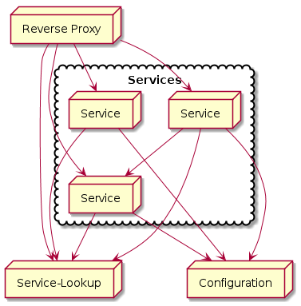
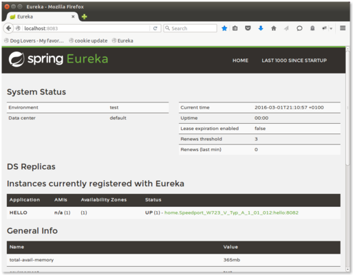

# Spring cloud

How would you setup a microservices-cloud? This is one way to setup a
cloud. It's agnostic to any solution on clustering your services and
mainly shows the usage of [spring-cloud].

We will build something that looks like this:  


What's interesting here is that we almost do not write any code to build
a system like this.

## The config server

The config server is the central place for any configuration. As most
spring-cloud artifacts it has it's own
[documentation](http://cloud.spring.io/spring-cloud-config/).

Spring-cloud-config takes a git repository as central
configuration-source. Like this you can always see what happend with the
configuration, and you can always revert changes, if they break things.  
You can store yaml- and properties-files, they will be merged, but it's
better if you only use one format.

Starting a config-server is pretty easy. You create a minimal
spring-boot-application, add the dependency for
[spring-cloud-starter-config](http://mvnrepository.com/artifact/org.springframework.cloud/spring-cloud-starter-config)
and add the annotation `@EnableConfigServer`. This will startup a
config-server, if you run it, but it needs to know where to find it's
configuration. The configuration-file
`/src/main/resources/application.properties` or `../application.yml`
needs to define the key `spring.cloud.config.server.git.uri`.

Here's my
[working example](https://github.com/javacasts/jc0005-spring-cloud/tree/config).

My example woks slightly different than usually, as I use git-branches
to separate the different parts of this screencast. So I have put the
configuration in it's own branch. I have also set the port that the
application is using to `8081` in the
[`application.properties`](https://github.com/javacasts/jc0005-spring-cloud/blob/config/src/main/resources/application.properties).

If you start this now, you can access the data from the
[configuration-repository](https://github.com/javacasts/jc0005-spring-cloud/tree/configuration)
via this service. The next service I will describe will be called
`hello`, there's already a configuration available. If the service is
started you can access it via `http://localhost:8081/hello/test/configuration`.

As you can see, there's not only one
[`hello.properties`](https://github.com/javacasts/jc0005-spring-cloud/blob/configuration/hello.properties)
available in the configuration-repository, there's also a
[`hello-test.properties`](https://github.com/javacasts/jc0005-spring-cloud/blob/configuration/hello-test.properties)
(don't yet care about the eureka configurations). If you change the URL
to `http://localhost:8081/configuration/hello/test.properties`, the
values from hello-test are added to the already available properties.
All properties from the according *profile* do overwrite any properties
from the *default* properties.

## The first service

Now it's time to use the configuration-service. I've already introduced
the configuration for the service named `hello`.

It's a pretty simple spring-boot-service (see
[javacasts episode 1](http://www.javacasts.net/spring/boot/2016/01/06/jc0001-spring-boot.html)
on spring boot), it will only return a simple string.

```java
@RestController
@SpringBootApplication
public class HelloApplication {

    @Value("${hello.text}")
    private String message;

    public static void main(String[] args) {
        SpringApplication.run(HelloApplication.class, args);
    }

    @RequestMapping("/")
    public String hello() {
        return message;
    }
}
```

You see, the
[application](https://github.com/javacasts/jc0005-spring-cloud/tree/hello)
uses a property `hello.text` to be able to have the text be changed easily. But
where is it configured, there's no `application.properties`. Well, there's a
[`bootstrap.properties`](https://github.com/javacasts/jc0005-spring-cloud/blob/hello/src/main/resources/bootstrap.properties).
It defines the URL of the config-server where it will get all it's
configuration, like the variable for `hello.text` and the port the
application should use, when the application is started, all this
configuration is loaded before the service starts.

Spring-cloud has different possibillities to reload the configuration
while the service is running. See
[Refresh Scope](http://cloud.spring.io/spring-cloud-static/docs/1.0.x/spring-cloud.html#_refresh_scope)
in the documentation.

## Service Discovery

If we want services to communicate, they need to find each other. To
achieve this, there's the service-discovery. spring-cloud uses *eureka*
from netflix. It's a service that runs on it's own, and it's as simple
as the config-server. You need to add the dependency
[spring-cloud-starter-eureka-server](http://mvnrepository.com/artifact/org.springframework.cloud/spring-cloud-starter-eureka-server),
annotate the service with `@EnableEurekaServer` and add the
configuration.

In this configuration I start the discovery standalone. I could have
the discovery get it's configuration via the config-service. It also
could work the other way around and have the config-server be found by
the discovery by each service.

Now we need the hello-service to register itself with the service. It
needs a new dependency of
[spring-cloud-starter-eureka](http://mvnrepository.com/artifact/org.springframework.cloud/spring-cloud-starter-eureka)
and the annotation `@EnableEurekaClient` (see the
[changeset](https://github.com/javacasts/jc0005-spring-cloud/commit/54eb3e019ba2acd0542f391e80e91987ef92afb5)).
At last it needs to be configured, but you've already seen this in the
configuration for the hello service in the configuration, see
[`hello.properties`](https://github.com/javacasts/jc0005-spring-cloud/blob/configuration/hello.properties).

If you have all servers running, the hello service will register itself
at the discovery-service. if you open `http://localhost:8085/`, you will
find the dashboard of eureka with a *hello*-service registered:  


## Proxy

The hello-service will start on a random port, you can start multiple instances
of the hello-service, but usually you want to provide a single URL to a user of
your system. So spring-cloud gives you a reverse proxy that takes a look at the
discovery and redirects the requests to the running services. Spring-cloud uses
the zuul proxy from netflix.  
The build of the proxy server is again pretty easy. You need the dependencies of
[spring-cloud-starter-zuul](http://mvnrepository.com/artifact/org.springframework.cloud/spring-cloud-starter-zuul)
and we configure again the use of the config-server, so we need some further
dependencies. The service itself is annotated with `@EnableZuulProxy`. Zuul
will itself decide to get the service from the discovery. If you start up the
[proxy-service](https://github.com/javacasts/jc0005-spring-cloud/tree/proxy) it
will load it's configuration from the config-service, get's the port from there
and the location of the discovery. It will (as it's not further configured)
route the `/hello`-path to the hello-service. So you can call
`http://localhost:8080/hello` and receive the result of one of the running
services.

## Intercept

There's one thing left to do. We want to connect the services. One needs to be
able to call another and use it's data. The good thing is, this is again pretty
easy. You can use a `RestTemplate` provided by spring. Instead of requesting a
host and port, you just use the name of the service and get directly a
result.  
So the
[service](https://github.com/javacasts/jc0005-spring-cloud/tree/intercept) can
look like this:

```java
@RestController
public class InterceptApplication {

    @Autowired
    private RestTemplate restTemplate;

    private static final DateFormat dateFormat = new SimpleDateFormat(
            "HH:mm:ss");

    @RequestMapping(value = "/", method = RequestMethod.GET)
    public String getMessage() {
        return dateFormat.format(new Date()) + ": "
                + restTemplate.getForObject("http://hello/", String.class);
    }
}
```

If you start this service and have it properly configured, it will call the
hello-service, append the current time and will return the new result. As the
service itself will register to the discovery the proxy will be able to
directly serve the intercept-service at `http://localhost:8080/intercept`.

## Hints & further information

It's not complicated to setup cloud services, but there are many things that
can go wrong. If you have problems take a look at the annotations, the
configuration of perhaps the dependencies. It's easy not to notice what's
missing.

Perhaps I could show you that the setup of a cloud is not a complicated issue.
It can be complex, but it's not complicated. You handle a complex application
you need a good reporting. You also should take a look at
[hystrix](http://projects.spring.io/spring-cloud/spring-cloud.html#_circuit_breaker_hystrix_dashboard).
